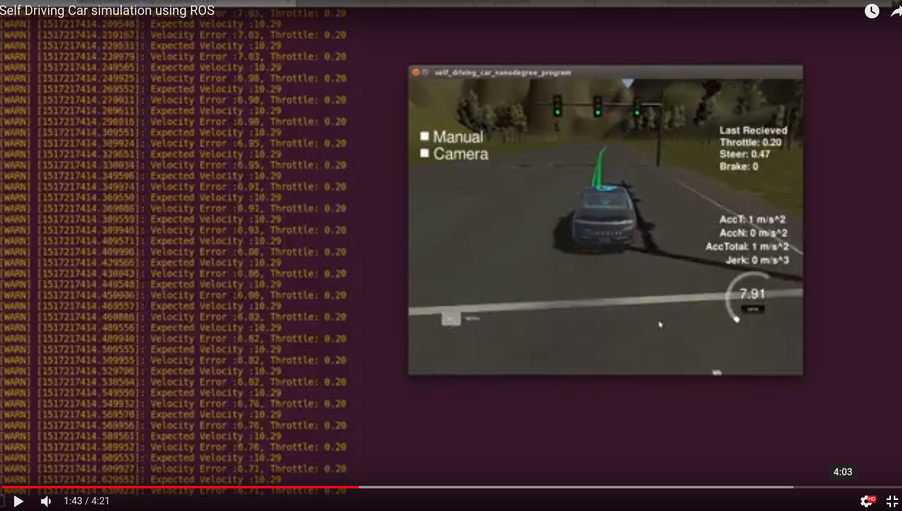

This is the project repo for the final project of the Udacity Self-Driving Car Nanodegree: Programming a Real Self-Driving Car. For more information about the project, see the project introduction [here](https://classroom.udacity.com/nanodegrees/nd013/parts/6047fe34-d93c-4f50-8336-b70ef10cb4b2/modules/e1a23b06-329a-4684-a717-ad476f0d8dff/lessons/462c933d-9f24-42d3-8bdc-a08a5fc866e4/concepts/5ab4b122-83e6-436d-850f-9f4d26627fd9).

###Team

| Team Members   | Email Address | Location      |
| ------------- | ------------- |----------------|
| Onur Ucler    | oucler@gmail.com | Folsom, CA    |
| Srikant Rao   | rao.shrikant@gmail.com | Folsom, CA    |

### Simulator Result

[](https://youtu.be/FPld5cNA4B0)


### Installation Instructions

* Be sure that your workstation is running Ubuntu 16.04 Xenial Xerus or Ubuntu 14.04 Trusty Tahir. [Ubuntu downloads can be found here](https://www.ubuntu.com/download/desktop).
* If using a Virtual Machine to install Ubuntu, use the following configuration as minimum:
  * 2 CPU
  * 2 GB system memory
  * 25 GB of free hard drive space

  The Udacity provided virtual machine has ROS and Dataspeed DBW already installed, so you can skip the next two steps if you are using this.

* Follow these instructions to install ROS
  * [ROS Kinetic](http://wiki.ros.org/kinetic/Installation/Ubuntu) if you have Ubuntu 16.04.
  * [ROS Indigo](http://wiki.ros.org/indigo/Installation/Ubuntu) if you have Ubuntu 14.04.
* [Dataspeed DBW](https://bitbucket.org/DataspeedInc/dbw_mkz_ros)
  * Use this option to install the SDK on a workstation that already has ROS installed: [One Line SDK Install (binary)](https://bitbucket.org/DataspeedInc/dbw_mkz_ros/src/81e63fcc335d7b64139d7482017d6a97b405e250/ROS_SETUP.md?fileviewer=file-view-default)
* Download the [Udacity Simulator](https://github.com/udacity/CarND-Capstone/releases).

### Setup

1. Clone the project repository
```bash
git clone https://github.com/srikantrao/System_Integration.git
```

2. Install python dependencies
```bash
cd CarND-Capstone
pip install -r requirements.txt
```
3. Make and run
```bash
cd ros
./clean.sh
source devel/setup.sh
```

4. Running different launch files for different scenarios

If you want to run the simulator, run the following command  
```bash
roslaunch launch/sim.launch
```
If you want to run it on the car, run the following command
```bash
roslaunch launch/site.launch
```
If you want to see a visualization of the detector working
```bash
roslaunch launch/site_visualization.launch
```
5. Run the simulator

### Real world testing
1. Download [training bag](https://drive.google.com/file/d/0B2_h37bMVw3iYkdJTlRSUlJIamM/view?usp=sharing) that was recorded on the Udacity self-driving car (a bag demonstraing the correct predictions in autonomous mode can be found [here](https://drive.google.com/open?id=0B2_h37bMVw3iT0ZEdlF4N01QbHc))
2. Unzip the file
```bash
unzip traffic_light_bag_files.zip
```
3. Play the bag file
```bash
rosbag play -l traffic_light_bag_files/loop_with_traffic_light.bag
```
4. Launch your project in site mode
```bash
cd CarND-Capstone/ros
roslaunch launch/site.launch
```
5. Confirm that traffic light detection works on real life images

You can confirm that the detector works on real life images by running the rosbag
```bash
cd CarND-Capstone/ros
roslaunch launch/site_visualization.launch
```
Open another terminal and go to CarND-Capstone/ros
```bash
source devel/setup.bash
rosbag play -l traffic_light_bag_files/loop_with_traffic_light.bag
```
Open another terminal and go to CarND-Capstone/ros

```bash
source devel/setupbash
rosrun tools rosbagVisual.py
```
## Object Detection
We have explored multiple options to detect traffic lights: firs t one was building our own Deep Convolutional Neural  Network (CNN) and using pre-trained models. 

What we noticed that we need a more data to train our CNN models to have a good model. Due to the limmitted training data and training time constraints we ended up using pre-trained object detection model (Fast Region-based Convolutional Network ). Here is the model link: https://github.com/tensorflow/models/tree/master/research/object_detection

A jupyter notbook was created to test the model accuracy and here are the some outputs. Please refer to the notebook, ~/classifier/faster-R-CNN/object_detection.ipynb, for more details.


## Implementation Details

### Twist Controller Node

The twist controller node was implemented using a PID controller for brake/throttle.

At a high level, the throttle value was given by
<p align="center">
  throttle = Kp * vel_err + Kd * vel_err_delta + Ki * vel_err_integral
</p>

If the throttle was negative, it was considered a brake value. The steering angle was determined based on code provided in yaw_controller.py

For the same radius
<p align="center"> v_obs * r = w_obs and v_ctrl * r = w_ctrl </p>
therefore,
<p align="center">
w_ctrl = w_obs * v_ctrl / v_obs
</p>
which can then be extended to calculate steering_angle.

A low pass filter usign exponentially weighted averages was used to smoothen the steering output result. The steering angle output is effectively a moving window average of the last 20 values for simulation and last 5 values for the site.
